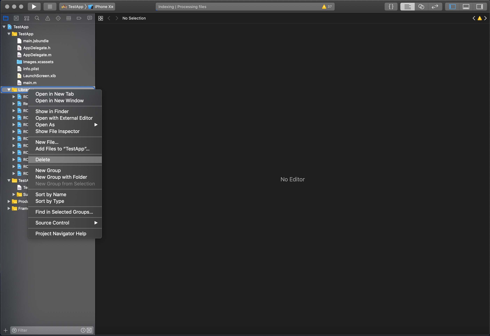
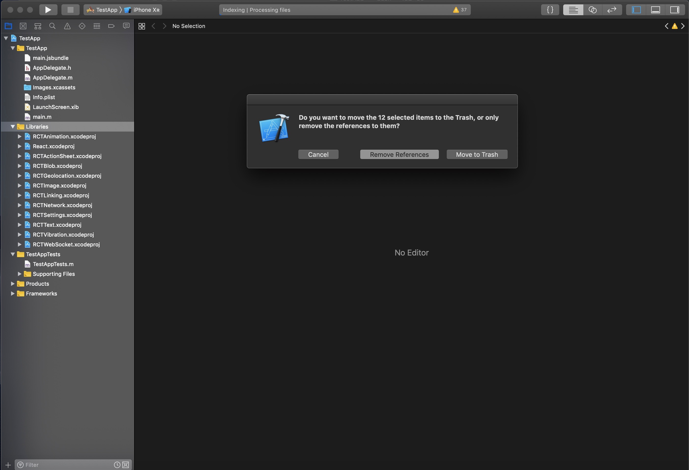
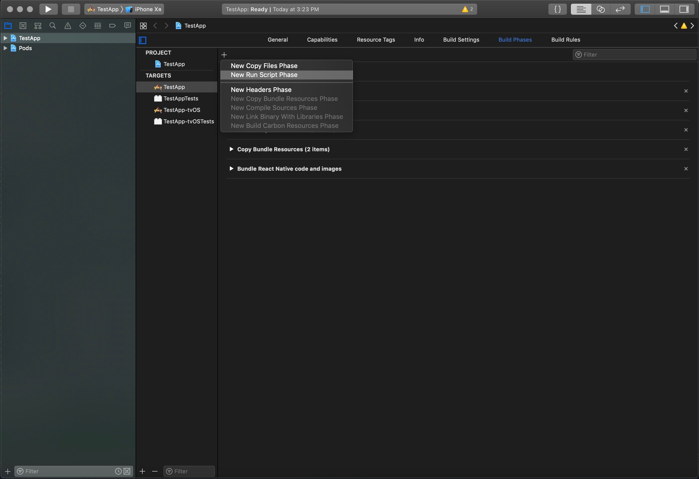
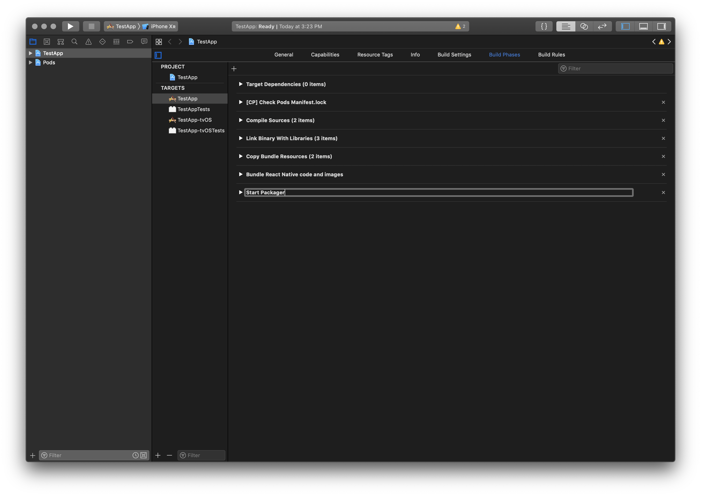
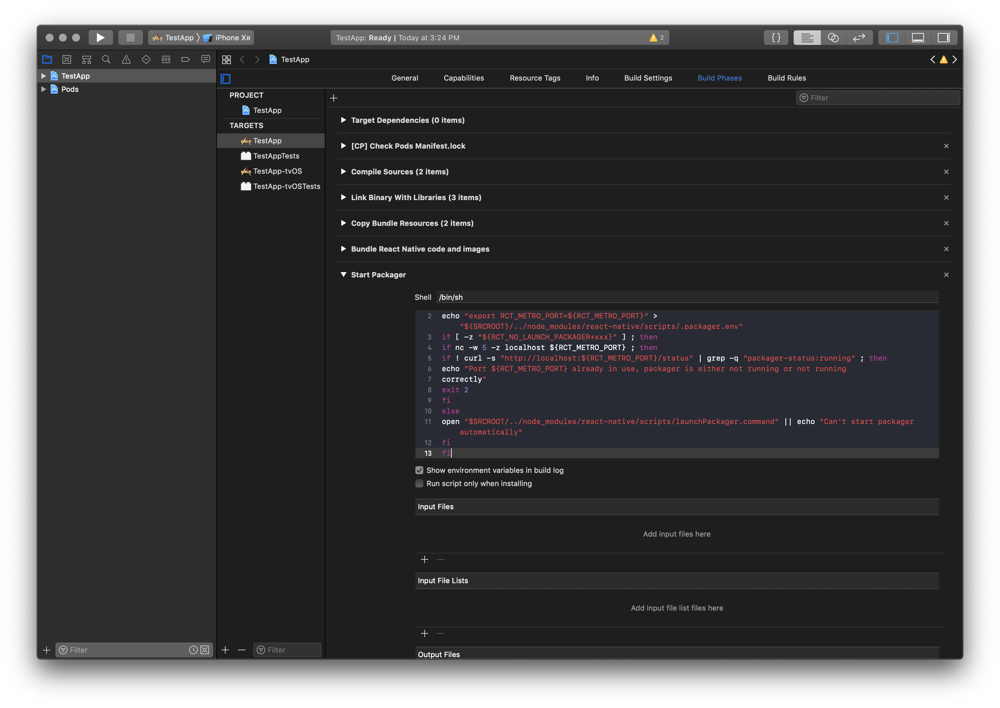
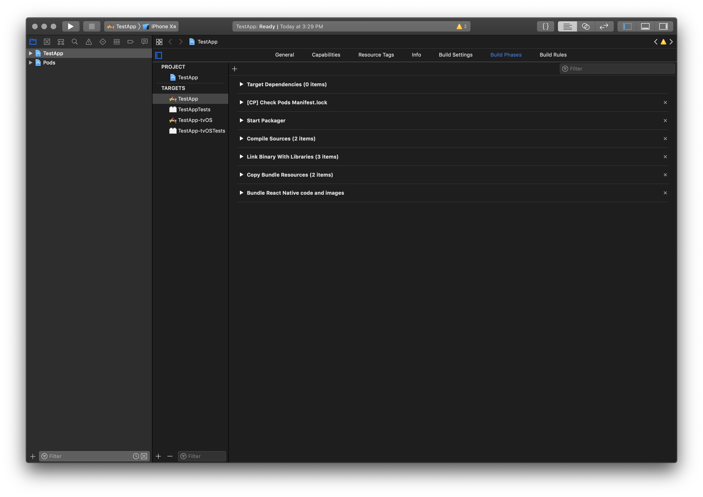

# Convert your app to use the React pod from node_modules

**Experimental:** Try the
[react_native_util](https://github.com/jdee/react_native_util) CLI.

```bash
brew install jdee/tap/react_native_util
cd /path/to/app
rn react_pod
```

## The basics

1. Run `react-native unlink` for each dependency with native
    components, e.g. `react-native unlink react-native-webview`.
1. Create a file called `Podfile` in the `ios` subdirectory of your app with
    these contents:
    ```ruby
    platform :ios, '9.0'

    target 'MyApp' do
      pod 'React',
        path: '../node_modules/react-native',
        subspecs: %w[
          Core
          CxxBridge
          DevSupport
          RCTActionSheet
          RCTAnimation
          RCTBlob
          RCTGeolocation
          RCTImage
          RCTLinkingIOS
          RCTNetwork
          RCTSettings
          RCTText
          RCTVibration
          RCTWebSocket
        ]
      pod 'yoga', path: '../node_modules/react-native/ReactCommon/yoga'
      pod 'Folly', podspec: '../node_modules/react-native/third-party-podspecs/Folly.podspec'
    end

    target 'MyAppTests' do
      pod 'React', path: '../node_modules/react-native', subspecs: %w[Core CxxBridge]
      pod 'yoga', path: '../node_modules/react-native/ReactCommon/yoga'
      pod 'Folly', podspec: '../node_modules/react-native/third-party-podspecs/Folly.podspec'
    end
    ```
    Replace `MyApp` with the name of your application target. The second target
    block is only necessary if you have a test target. You may need to
    add other targets as well.

    Also note that your `subspecs` may vary depending on your needs.
1. Use frameworks (Recommended):
    CocoaPods can optionally build dependencies as frameworks rather than
    static libraries (the default). To enable this, add `use_frameworks!`
    (with the exclamation point) on a separate line below `platform` at the
    top:
    ```Ruby
    platform :ios, '9.0'

    use_frameworks!

    target 'MyApp' do
      pod 'React',
        path: '../node_modules/react-native',
        subspecs: %w[
          Core
        # ...
    ```
    For some dependencies, e.g. react-native-branch, it may be necessary to
    change any `#import` statement in your native app code if you specify
    `use_frameworks!`. Omitting `use_frameworks!` from the Podfile will not
    require any import changes and may make your transition simpler. If you
    later add `use_frameworks!` to the `Podfile`, just run `pod install`
    again (see below) and modify any necessary imports.

    For react-native-branch, the import should be:

    _Using frameworks_
    ```Objective-C
    @import react_native_branch;
    ```

    _Not using frameworks_
    ```Objective-C
    #import <react-native-branch/RNBranch.h>
    ```
1. Run `react-native link` (from the project root) for each dependency with
    native components, e.g.
    `react-native link react-native-branch`. This will add appropriate
    dependencies to your Podfile.
1. Install CocoaPods if necessary:
    https://guides.cocoapods.org/using/getting-started.html#installation.
    **Recommended**: Use a Gemfile to install CocoaPods for your project.
    At the project root, add a file called `Gemfile` with these contents:
    ```ruby
    source 'https://rubygems.org'

    # Install any 1.x >= 1.6
    gem 'cocoapods', '~> 1.6'
    ```
    Now at the command line type `bundle install`. This generates a file
    called `Gemfile.lock`. Commit both `Gemfile` and `Gemfile.lock` to
    SCM. Now prefix any `pod` command with `bundle exec`, e.g.:
    ```bash
    bundle exec pod install --repo-update
    ```
    This ensures that you execute the version of CocoaPods specified in the
    Gemfile.lock, which will make your results more reproducible.

    **Protip:** Use `bundle check || bundle install` instead of just
    `bundle install`, particularly in scripts, to reduce execution time in case
    `bundle install` is not necessary.
1. At the command line, from the `ios` subdirectory where you created the
    `Podfile`:
    ```bash
    pod install --repo-update
    ```
    The `--repo-update` option ensures that your local podspec repo is
    up to date before running `pod install`. This is slow and does not happen
    by default. It is a good idea to supply this option the first time you
    run `pod install` unless you are certain your podspec repo is current.
    Instead of `pod install --repo-update`, you may also run `pod repo update`
    separately:
    ```bash
    pod repo update
    pod install
    ```

    The `pod install` command will generate a number of files, all of which
    should be checked into source control:

    Podfile.lock: like yarn.lock, records the resolution of all dependencies
    from CocoaPods.

    Pods: folder containing generated code. It is common practice to check in
    this folder, avoiding the need to run `pod install` before building.

    MyApp.xcworkspace: Generated and maintained by CocoaPods. From now on,
    whenever you work with your app, you should open the workspace with
    Xcode instead of the project. (Instead of MyApp, the generated workspace
    will have the same name as your Xcode project.)

    Each time you add dependencies
    with `react-native link`, you will need to run `pod install` again.
    Remember to update your podspec repo from time to time. (This happens
    automatically when you run `pod update` unless you use the
    `--no-repo-update` option.)
    Running `pod
    install` will regenerate the code under `Pods` each time to include any
    new dependencies.
1. Remove the `Libraries` group from your project altogether to avoid conflicts
    with the same dependencies from the Pods project. Right-click on the
    group and select Delete.
    
    When asked for confirmation, select Remove
    References rather than Move to Trash. The same files are used by the React
    pod.
    

Now your workspace will build your app including all the appropriate
dependencies from CocoaPods.

## Starting the packager (advanced)

A project generated with `react-native init` will automatically
start the Metro packager.
When you remove the Libraries group containing the `React.xcodeproj` in favor
of the `React` pod, this will no longer happen unless you set it up again in
Xcode. To restore this automation:

1. Open the workspace for your project. Select your application target and
    navigate to the Build Phases tab.
1. Click the `+` button at the upper left of the Build Phases tab and select
    New Run Script Phase.
    
1. This will produce a new build phase at the end called Run Script.
    Double-click this title to edit it. Change it to Start Packager.
    
1. Expand this build phase and replace the contents of the first text box
    with the following:
    ```bash
    export RCT_METRO_PORT="${RCT_METRO_PORT:=8081}"
    echo "export RCT_METRO_PORT=${RCT_METRO_PORT}" > "${SRCROOT}/../node_modules/react-native/scripts/.packager.env"
    if [ -z "${RCT_NO_LAUNCH_PACKAGER+xxx}" ] ; then
      if nc -w 5 -z localhost ${RCT_METRO_PORT} ; then
        if ! curl -s "http://localhost:${RCT_METRO_PORT}/status" | grep -q "packager-status:running" ; then
          echo "Port ${RCT_METRO_PORT} already in use, packager is either not running or not running
    correctly"
          exit 2
        fi
      else
        open "$SRCROOT/../node_modules/react-native/scripts/launchPackager.command" || echo "Can't start packager automatically"
      fi
    fi
    ```
    Xcode will not preserve the indentation.
    
1. Drag this new build phase to just after [CP] Check Pods Manifest.lock.
    

Now whenever you build and run your app, Xcode will ensure that the Metro
packager is running.
