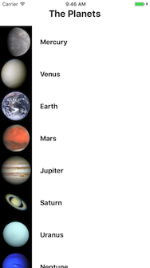
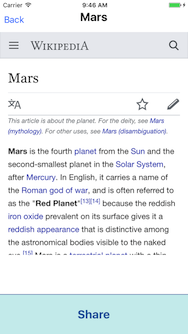

# webview_tutorial

This tutorial starts with a simple content app that does not use Branch. The main
view shows a list of the planets. Select any row in the list to see the Wikipedia
page for that planet in a web view with a Share button. The Share button is
initially unimplemented.




In the course of the tutorial, you will add the `react-native-branch` SDK to
this app and implement sharing and deep link routing using Branch. The finished
product will be essentially the same as the complete `webview_example` in this
repo.

## Prerequisites

Make sure your app is set up in the [Branch Dashboard](https://dashboard.branch.io).
From the Dashboard, you need:

  - Your Branch live and test keys
  - The domains used with these keys
  - The bundle identifier associated with your app in the Dashboard (iOS only)

Run `yarn` or `npm install` first to supply all dependencies in `node_modules`.

## Installation

1. Add the react-native-branch SDK.

    ```bash
    yarn add react-native-branch
    ```

    or

    ```bash
    npm install --save react-native-branch
    ```

    This installs the latest release from NPM. To use the SDK from this local repo instead of NPM:

    ```bash
    yarn add file:../..
    ```

    or

    ```bash
    npm install --save ../..
    ```

2. Run `react-native link`:

    ```bash
    react-native link react-native-branch
    ```

## iOS/Xcode setup

1. Open the `ios/webview_tutorial.xcodeproj` using Xcode. Select the AppDelegate.m file from the
    left panel. Alternately, open `ios/webview_tutorial/AppDelegate.m` in your favorite editor.
    At the top of the file, add:

    ```Objective-C
    #import <react-native-branch/RNBranch.h>
    ```

2. Find the `application:didFinishLaunchingWithOptions:` method near the top of the AppDelegate.m
    file. Add the following to the beginning of that method:

    ```Objective-C
    #ifdef DEBUG
        [RNBranch useTestInstance];
    #endif // DEBUG

    [RNBranch initSessionWithLaunchOptions:launchOptions isReferrable:YES];
    ```

3. Add the following method before the final `@end` in the AppDelegate.m file:

    ```Objective-C
    - (BOOL)application:(UIApplication *)app openURL:(NSURL *)url options:(NSDictionary<UIApplicationOpenURLOptionsKey,id> *)options
    {
      return [RNBranch.branch application:app openURL:url options:options] || [[UIApplication sharedApplication] openURL:url];
    }

    - (BOOL)application:(UIApplication *)app continueUserActivity:(nonnull NSUserActivity *)userActivity restorationHandler:(nonnull void (^)(NSArray * _Nullable))restorationHandler
    {
        return [RNBranch.branch continueUserActivity:userActivity];
    }
    ```

    The complete AppDelegate should look like this:

    ```Objective-C
    #import "AppDelegate.h"

    #import <React/RCTBundleURLProvider.h>
    #import <React/RCTRootView.h>

    // Step 1: Add RNBranch import

    #import <react-native-branch/RNBranch.h>

    @implementation AppDelegate

    - (BOOL)application:(UIApplication *)application didFinishLaunchingWithOptions:(NSDictionary *)launchOptions
    {
      // Step 2: Add call to [RNBranch initSessionWithLaunchOptions:isReferrable:]
    #ifdef DEBUG
      [RNBranch useTestInstance];
    #endif // DEBUG
      [RNBranch initSessionWithLaunchOptions:launchOptions isReferrable:YES];

      NSURL *jsCodeLocation;

      jsCodeLocation = [[RCTBundleURLProvider sharedSettings] jsBundleURLForBundleRoot:@"index.ios" fallbackResource:nil];

      RCTRootView *rootView = [[RCTRootView alloc] initWithBundleURL:jsCodeLocation
                                                          moduleName:@"webview_tutorial"
                                                   initialProperties:nil
                                                       launchOptions:launchOptions];
      rootView.backgroundColor = [[UIColor alloc] initWithRed:1.0f green:1.0f blue:1.0f alpha:1];

      self.window = [[UIWindow alloc] initWithFrame:[UIScreen mainScreen].bounds];
      UIViewController *rootViewController = [UIViewController new];
      rootViewController.view = rootView;
      self.window.rootViewController = rootViewController;
      [self.window makeKeyAndVisible];
      return YES;
    }

    // Step 3: Add application:openURL:options: and application:continueUserActivity:restorationHandler: methods

    - (BOOL)application:(UIApplication *)app openURL:(NSURL *)url options:(NSDictionary<UIApplicationOpenURLOptionsKey,id> *)options
    {
      return [RNBranch.branch application:app openURL:url options:options] || [[UIApplication sharedApplication] openURL:url];
    }

    - (BOOL)application:(UIApplication *)app continueUserActivity:(nonnull NSUserActivity *)userActivity restorationHandler:(nonnull void (^)(NSArray * _Nullable))restorationHandler
    {
      return [RNBranch.branch continueUserActivity:userActivity];
    }

    @end
    ```

4. In Xcode, change the bundle identifier to the correct bundle identifier for your Branch app
    (see the [Branch Dashboard](https://dashboard.branch.io)). Also
    change the code signing settings to use your signing team.

    

5. In Xcode, add your Branch keys to the Info.plist as a dictionary.

    

6. In Xcode, add your Branch domains to the application's associated domains. Be sure to
    prefix each domain with `applinks:`.

    

7. If using a custom URI scheme in the Branch Dashboard, add that URI scheme to the app's Info.plist.

    

## Android setup

1. Open the `android` project in Android Studio. Open the `MainApplication.java` file in Android Studio.
    Alternately, open `android/app/src/main/java/com/webview_tutorial/MainApplication.java` in your
    favorite text editor. At the top of the file, after the `package` declaration, add the following line:

    ```Java
    import io.branch.referral.Branch;
    ```

2. In the `onCreate` method, add the following line:

    ```Java
    Branch.getAutoInstance(this);
    ```

    The complete MainApplication should look like this:

    ```Java
    package com.webview_tutorial;

    // Step 1: Add Branch import
    import io.branch.referral.Branch;

    import android.app.Application;

    import com.facebook.react.ReactApplication;
    import com.facebook.react.ReactNativeHost;
    import com.facebook.react.ReactPackage;
    import com.facebook.react.shell.MainReactPackage;
    import com.facebook.soloader.SoLoader;

    import java.util.Arrays;
    import java.util.List;

    public class MainApplication extends Application implements ReactApplication {

      private final ReactNativeHost mReactNativeHost = new ReactNativeHost(this) {
        @Override
        public boolean getUseDeveloperSupport() {
          return BuildConfig.DEBUG;
        }

        @Override
        protected List<ReactPackage> getPackages() {
          return Arrays.<ReactPackage>asList(
              new MainReactPackage()
          );
        }
      };

      @Override
      public ReactNativeHost getReactNativeHost() {
        return mReactNativeHost;
      }

      @Override
      public void onCreate() {
        super.onCreate();
        SoLoader.init(this, /* native exopackage */ false);

        // Step 2: Add call to Branch.getAutoInstance
        Branch.getAutoInstance(this);
      }
    }
    ```

3. Open the `android/app/src/main/java/com/webview_tutorial/MainActivity.java` file in Android Studio
    or your favorite editor. Add the following imports near the top of the file:

    ```Java
    import io.branch.rnbranch.RNBranchModule;
    import android.content.Intent;
    ```

4. Add the `onStart` method in the MainActivity:

    ```Java
    @Override
    protected void onStart() {
        super.onStart();
        RNBranchModule.initSession(getIntent().getData(), this);
    }
    ```

5. Add the `onNewIntent` method in the MainActivity:

    ```Java
    @Override
    public void onNewIntent(Intent intent) {
        super.onNewIntent(intent);
        setIntent(intent);
    }
    ```

    The complete MainActivity should look like this:

    ```Java
    package com.webview_tutorial;

    // Step 3: Import RNBranchModule and Android Intent class
    import io.branch.rnbranch.RNBranchModule;
    import android.content.Intent;

    import com.facebook.react.ReactActivity;

    public class MainActivity extends ReactActivity {

        /**
         * Returns the name of the main component registered from JavaScript.
         * This is used to schedule rendering of the component.
         */
        @Override
        protected String getMainComponentName() {
            return "webview_tutorial";
        }

        // Step 4: Add onStart method
        @Override
        protected void onStart() {
            super.onStart();
            RNBranchModule.initSession(getIntent().getData(), this);
        }

        // Step 5: Add onNewIntent method
        @Override
        public void onNewIntent(Intent intent) {
            super.onNewIntent(intent);
            setIntent(intent);
        }

    }
    ```

6. Open the `android/app/src/main/AndroidManifest.xml` in Android Studio or a text editor. Add
    `android:launchMode="singleTask"` to the MainActivity:

    ```xml
    <activity
        android:name=".MainActivity"
        android:label="@string/app_name"
        android:configChanges="keyboard|keyboardHidden|orientation|screenSize"
        android:windowSoftInputMode="adjustResize"
        android:launchMode="singleTask">
    ```

7. Add `intent-filters` to the MainActivity in the Android manifest using your Branch domains:

    ```xml
    <intent-filter android:autoVerify="true">
        <action android:name="android.intent.action.VIEW"/>
        <category android:name="android.intent.category.DEFAULT"/>
        <category android:name="android.intent.category.BROWSABLE"/>
        <data android:scheme="https" android:host="yourapp.app.link"/>
        <data android:scheme="https" android:host="yourapp-alternate.app.link"/>
        <data android:scheme="https" android:host="yourapp.test-app.link"/>
        <data android:scheme="https" android:host="yourapp-alternate.test-app.link"/>
    </intent-filter>
    ```

    Replace `yourapp` in the example above with your `app.link` subdomain from the
    Branch portal.

    If using a custom URI scheme in the Branch Dashboard, also add an `intent-filter` for
    that URI scheme.

    ```xml
    <intent-filter>
        <action android:name="android.intent.action.VIEW"/>
        <category android:name="android.intent.category.DEFAULT"/>
        <category android:name="android.intent.category.BROWSABLE"/>
        <data android:scheme="myurischeme" android:host="open"/>
    </intent-filter>
    ```

    Replace `myurischeme` with your actual URI scheme.

8. Add your Branch keys to the Android manifest at the end of the application element.

    ```xml
    <!-- Branch keys -->
    <meta-data android:name="io.branch.sdk.BranchKey" android:value="key_live_xxxx"/>
    <meta-data android:name="io.branch.sdk.BranchKey.test" android:value="key_test_yyyy"/>
    ```

    Replace `key_live_xxxx` and `key_test_yyyy` with your Branch live and test keys from the
    Branch Dashboard.

    The complete main manifest should look like this:

    ```xml
    <manifest xmlns:android="http://schemas.android.com/apk/res/android"
         package="com.webview_tutorial"
         android:versionCode="1"
         android:versionName="1.0">

         <uses-permission android:name="android.permission.INTERNET" />
         <uses-permission android:name="android.permission.SYSTEM_ALERT_WINDOW"/>

         <uses-sdk
             android:minSdkVersion="16"
             android:targetSdkVersion="22" />

         <application
             android:name=".MainApplication"
             android:allowBackup="true"
             android:label="@string/app_name"
             android:icon="@mipmap/ic_launcher"
             android:theme="@style/AppTheme"
             android:launchMode="singleTask">
             <!-- Step 6: Add singleTask to the MainActivity above -->
             <activity
                 android:name=".MainActivity"
                 android:label="@string/app_name"
                 android:configChanges="keyboard|keyboardHidden|orientation|screenSize"
                 android:windowSoftInputMode="adjustResize">
                 <intent-filter>
                     <action android:name="android.intent.action.MAIN" />
                     <category android:name="android.intent.category.LAUNCHER" />
                 </intent-filter>
                 <!-- Step 7: Add intent-filters -->
                 <intent-filter android:autoVerify="true">
                     <action android:name="android.intent.action.VIEW"/>
                     <category android:name="android.intent.category.DEFAULT"/>
                     <category android:name="android.intent.category.BROWSABLE"/>
                     <data android:scheme="https" android:host="yourapp.app.link"/>
                     <data android:scheme="https" android:host="yourapp-alternate.app.link"/>
                     <data android:scheme="https" android:host="yourapp.test-app.link"/>
                     <data android:scheme="https" android:host="yourapp-alternate.test-app.link"/>
                 </intent-filter>
                 <intent-filter>
                     <action android:name="android.intent.action.VIEW"/>
                     <category android:name="android.intent.category.DEFAULT"/>
                     <category android:name="android.intent.category.BROWSABLE"/>
                     <data android:scheme="myurischeme" android:host="open"/>
                 </intent-filter>
             </activity>
             <activity android:name="com.facebook.react.devsupport.DevSettingsActivity" />
             <!-- Step 8: Add Branch keys -->
             <!-- Branch keys -->
             <meta-data android:name="io.branch.sdk.BranchKey" android:value="key_live_xxxx"/>
             <meta-data android:name="io.branch.sdk.BranchKey.test" android:value="key_test_yyyy"/>
         </application>

    </manifest>
    ```

9. Add a file called `android/app/src/debug/AndroidManifest.xml` with the following contents:

    ```xml
    <manifest xmlns:android="http://schemas.android.com/apk/res/android"
        package="com.webview_tutorial">

        <application>
            <meta-data android:name="io.branch.sdk.TestMode" android:value="true" /> <!-- Set to true to use Branch_Test_Key -->
        </application>

    </manifest>
    ```

10. Open the file `android/app/proguard-rules.pro` and add the following line at the end:

    ```proguard
    -dontwarn io.branch.**
    ```

## React Native setup

1. Open the file `src/ArticleList.js`. Add the following line to import the react-native-branch SDK:

    ```js
    import branch from 'react-native-branch'
    ```

2. Add a property to the ArticleList class called `_unsubscribeFromBranch`. Initialize it to null:

    ```js
    _unsubscribeFromBranch = null
    ```

3. Add a `componentDidMount` method to the ArticleList class:

    ```js
    componentDidMount() {
      this._unsubscribeFromBranch = branch.subscribe(({ error, params }) => {
        if (error) {
          console.error("Error from Branch: " + error)
          return
        }

        console.log("Branch params: " + JSON.stringify(params))

        if (!params['+clicked_branch_link']) return

        // Get title and url for route
        let title = params.$og_title
        let url = params.$canonical_url
        let image = params.$og_image_url

        // Now push the view for this URL
        this.props.navigation.navigate('Article', {url: url, title: title, image: image})
      })
    }
    ```

4. Add a `componentWillUnmount` method to the ArticleList class:

    ```js
    componentWillUnmount() {
      if (this._unsubscribeFromBranch) {
        this._unsubscribeFromBranch()
        this._unsubscribeFromBranch = null
      }
    }
    ```

    The complete ArticleList class should look like this:

    ```js
    import React, { Component } from 'react'
    import { Text, Image, ListView, StyleSheet, TouchableHighlight, View } from 'react-native'

    // Step 1: import Branch
    import branch from 'react-native-branch'

    import Article from './Article'

    const styles = StyleSheet.create({
      container: {
        flex: 1,
        marginTop: 0
      },
    })

    class ArticleList extends Component {
      // Step 2: Add _unsubscribeFromBranch property
      _unsubscribeFromBranch = null

      constructor(props) {
        super(props)

        const ds = new ListView.DataSource({rowHasChanged: (r1, r2) => r1 !== r2})
        this.state = {
          dataSource: ds.cloneWithRows([
            { title: 'Mercury', url: 'https://en.wikipedia.org/wiki/Mercury_(planet)', image: 'https://upload.wikimedia.org/wikipedia/commons/d/d9/Mercury_in_color_-_Prockter07-edit1.jpg' },
            { title: 'Venus', url: 'https://en.wikipedia.org/wiki/Venus', image: 'https://upload.wikimedia.org/wikipedia/commons/e/e5/Venus-real_color.jpg' },
            { title: 'Earth', url: 'https://en.wikipedia.org/wiki/Earth', image: 'https://upload.wikimedia.org/wikipedia/commons/9/97/The_Earth_seen_from_Apollo_17.jpg' },
            { title: 'Mars', url: 'https://en.wikipedia.org/wiki/Mars', image: 'https://upload.wikimedia.org/wikipedia/commons/0/02/OSIRIS_Mars_true_color.jpg' },
            { title: 'Jupiter', url: 'https://en.wikipedia.org/wiki/Jupiter', image: 'https://upload.wikimedia.org/wikipedia/commons/2/2b/Jupiter_and_its_shrunken_Great_Red_Spot.jpg' },
            { title: 'Saturn', url: 'https://en.wikipedia.org/wiki/Saturn', image: 'https://upload.wikimedia.org/wikipedia/commons/c/c0/Saturn-27-03-04.jpeg' },
            { title: 'Uranus', url: 'https://en.wikipedia.org/wiki/Uranus', image: 'https://upload.wikimedia.org/wikipedia/commons/3/3d/Uranus2.jpg' },
            { title: 'Neptune', url: 'https://en.wikipedia.org/wiki/Neptune', image: 'https://upload.wikimedia.org/wikipedia/commons/5/56/Neptune_Full.jpg' },
            { title: 'Pluto', url: 'https://en.wikipedia.org/wiki/Pluto', image: 'https://upload.wikimedia.org/wikipedia/commons/2/2a/Nh-pluto-in-true-color_2x_JPEG-edit-frame.jpg' },
          ]),
        }
      }

      // Step 3: Add componentDidMount
      componentDidMount() {
        this._unsubscribeFromBranch = branch.subscribe(({ error, params }) => {
          if (error) {
            console.error("Error from Branch: " + error)
            return
          }

          console.log("Branch params: " + JSON.stringify(params))

          if (!params['+clicked_branch_link']) return

          // Get title and url for route
          let title = params.$og_title
          let url = params.$canonical_url
          let image = params.$og_image_url

          // Now push the view for this URL
          this.props.navigation.navigate('Article', {url: url, title: title, image: image})
        })
      }

      // Step 4: Add componentWillUnmount
      componentWillUnmount() {
        if (this._unsubscribeFromBranch) {
          this._unsubscribeFromBranch()
          this._unsubscribeFromBranch = null
        }
      }

      render() {
        return (
          <ListView
            style={styles.container}
            dataSource={this.state.dataSource}
            renderRow={(data) =>
              <TouchableHighlight
                onPress={() => { this._showArticle(data) }}>
                <View
                  style={{flex: 1, flexDirection: 'row', alignItems: 'center'}}>
                  <Image
                    style={{width: 80, height: 80}}
                    source={{uri: data.image}}/>
                  <Text
                    style={{fontWeight: 'bold', fontSize: 17, margin: 20}}>
                    {data.title}
                  </Text>
                </View>
              </TouchableHighlight>}
          />
        )
      }

      _showArticle(data) {
        console.log("Show article with URL " + data.url)
        this.props.navigation.navigate('Article', data)
      }
    }

    export default ArticleList
    ```

5. Open the `src/Article.js` class. Import the `branch` instance and the `BranchEvent`
    class.

    ```js
    import branch, { BranchEvent } from 'react-native-branch'
    ```

6. Add a `buo` property to the Article class and initialize it to null;

    ```js
    buo = null
    ```

7. Create a Branch Universal Object in the `componentDidMount` method and register a view
    event. Add the following method to the Article class:

    ```js
    async componentDidMount() {
      this.buo = await branch.createBranchUniversalObject("planet/" + this.props.navigation.state.params.title, {
        locallyIndex: true,
        canonicalUrl: this.props.navigation.state.params.url,
        title: this.props.navigation.state.params.title,
        contentImageUrl: this.props.navigation.state.params.image
      })
      this.buo.logEvent(BranchEvent.ViewItem)
      console.log("Created Branch Universal Object and logged standard view item event.")
    }
    ```

8. Add a `componentWillUnmount` method with a call to `this.buo.release()`.
    ```js
    componentWillUnmount() {
      if (!this.buo) return
      this.buo.release()
      this.buo = null
    }
    ```

9. Implement the `onShare` method to show the Branch share sheet. Add the following as the
    body of the onShare method:

    ```js
    let { channel, completed, error } = await this.buo.showShareSheet({
      emailSubject: "The Planet " + this.props.navigation.state.params.title,
      messageBody: "Read about the planet " + this.props.navigation.state.params.title + ".",
      messageHeader: "The Planet " + this.props.navigation.state.params.title
    }, {
      feature: "share",
      channel: "RNApp"
    }, {
      $desktop_url: this.props.navigation.state.params.url,
      $ios_deepview: "branch_default"
    })

    if (error) {
      console.error("Error sharing via Branch: " + error)
      return
    }

    console.log("Share to " + channel + " completed: " + completed)
    ```

    The complete Article class should look like this:

    ```js
    import React, { Component } from 'react'
    import { StyleSheet, Text, TouchableHighlight, View, WebView } from 'react-native'

    // Step 5: Import branch and BranchEvent
    import branch, { BranchEvent } from 'react-native-branch'

    const styles = StyleSheet.create({
      container: {
        flex: 1,
        flexDirection: 'column'
      },
      webView: {
      },
      button: {
        backgroundColor: '#cceeee',
        borderColor: '#2266aa',
        borderTopWidth: 1,
        flex: 0.15,
        justifyContent: 'center'
      },
      buttonText: {
        color: '#2266aa',
        fontSize: 23,
        fontWeight: 'bold',
        textAlign: 'center'
      }
    })

    export default class Article extends Component {
      // Step 6: Add buo property
      buo = null

      // Step 7: Add componentDidMount
      async componentDidMount() {
        this.buo = await branch.createBranchUniversalObject("planet/" + this.props.navigation.state.params.title, {
          locallyIndex: true,
          canonicalUrl: this.props.navigation.state.params.url,
          title: this.props.navigation.state.params.title,
          contentImageUrl: this.props.navigation.state.params.image
        })
        this.buo.logEvent(BranchEvent.ViewItem)
        console.log("Created Branch Universal Object and logged standard view item event.")
      }

      // Step 8: Add componentWillUnmount
      componentWillUnmount() {
        if (!this.buo) return
        this.buo.release()
        this.buo = null
      }

      render() {
        return (
          <View
            style={styles.container} >
            <WebView
              style={styles.webView}
              source={{uri: this.props.navigation.state.params.url}} />
            <TouchableHighlight
              onPress={() => this.onShare()}
              style={styles.button} >
              <Text
                style={styles.buttonText}>
                Share
              </Text>
            </TouchableHighlight>
          </View>
        )
      }

      async onShare() {
        // Step 9: Implement onShare
        let { channel, completed, error } = await this.buo.showShareSheet({
          emailSubject: "The Planet " + this.props.navigation.state.params.title,
          messageBody: "Read about the planet " + this.props.navigation.state.params.title + ".",
          messageHeader: "The Planet " + this.props.navigation.state.params.title
        }, {
          feature: "share",
          channel: "RNApp"
        }, {
          $desktop_url: this.props.navigation.state.params.url,
          $ios_deepview: "branch_default"
        })

        if (error) {
          console.error("Error sharing via Branch: " + error)
          return
        }

        console.log("Share to " + channel + " completed: " + completed)
      }
    }
    ```

## Build and run

The app now includes a complete Branch integration. Try it out with

```bash
react-native run-android
```

or

```bash
react-native run-ios
```

or just open the projects in Android Studio or Xcode, build and run.

Select any article and then press the Share button. Use it to share the content in any
way you like, e.g. mail yourself a link or copy it and paste it into the Notes app.
Open any link generated in the app. The app will be launched, and the appropriate content
will be displayed.

## Notes

The following are not included yet in this tutorial.

- Setting up custom Branch domains or non-Branch domains
- Handling non-Branch domains
- Using a single Branch key
